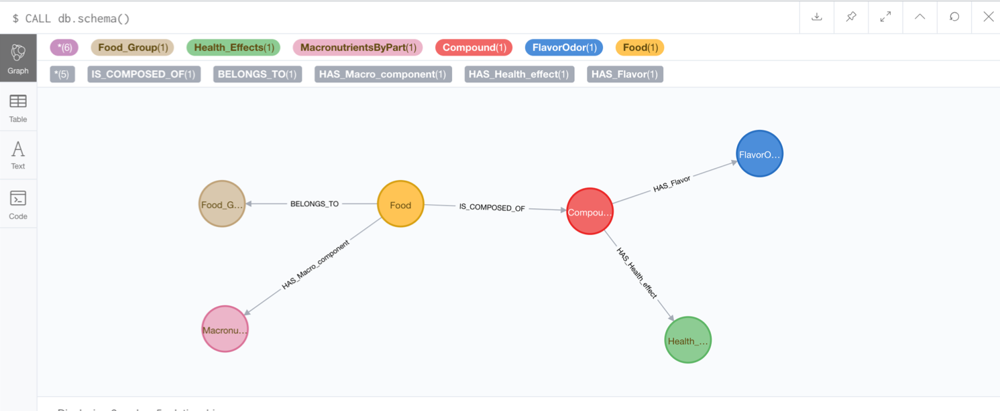

FooDB-graph 
=======

Author: Leah Guthrie


[Summary]

Overview
--------

```
FooDB-graph 
	|
  |- README          # the top level description of content (this doc)
  |- CONTRIBUTING    # instructions for how to contribute to this project
	|
  |- analysis/       # documentation for the study
  |  |- notebooks/   # any analysis relating to foodb relationships
  |  |- tables/      # text version of tables to be rendered 
  |  |- figures/     # graphs, 
  |  +- pictures/    # diagrams, images, and other non-graph graphics  
  |
  |- neo4j           # data used to construct foodb neo4j graph
  |  |- bin/  # reference files to be used in analysis
  |  |- conf/         # raw data, will not be altered
  |  |- data/      # mothur processed data 
  |  |- import/  # reference files to be used in analysis
  |  |- lib/         # raw data, will not be altered
  |  |- logs/      # mothur processed data
  |  |- plugins/  # reference files to be used in analysis
  |  |- run/         # raw data, will not be altered
  |  |- LICENSE.txt/      # mothur processed data
  |  |- LICENSES.txt/      # mothur processed data
  |  |- NOTICE.txt/      # mothur processed data
  |  |- README.txt/      # mothur processed data
  |  |- LICENSES.txt/      # mothur processed data
  |  +-UPGRADE.txt    # cleaned data, will not be altered once created;
  |  
  |- images/           # 
  |
  |- GCP/           # any code related to GCP hosting
  |- queries         # 
  |  |- healthEffects.md      # 
  |  +- figures/    # graphics
  +- Makefile        # executable Makefile for this study, if applicable
```


### Connect to FooDB-graph

```
cd neo4j/
./bin/neo4j console
```

```
Starting Neo4j.
2018-07-31 10:51:31.661+0000 INFO  ======== Neo4j 3.4.4 ========
2018-07-31 10:51:31.750+0000 INFO  Starting...
2018-07-31 10:51:35.761+0000 INFO  Bolt enabled on 127.0.0.1:7687.
2018-07-31 10:51:39.992+0000 INFO  Started.
2018-07-31 10:51:41.831+0000 WARN  Low configured threads: (max={} - required={})={} < warnAt={} for {}
2018-07-31 10:51:41.850+0000 INFO  Remote interface available at http://localhost:7474/
```

This database was created by Leah Guthrie using publically available data from http://foodb.ca/ and neo4j.
